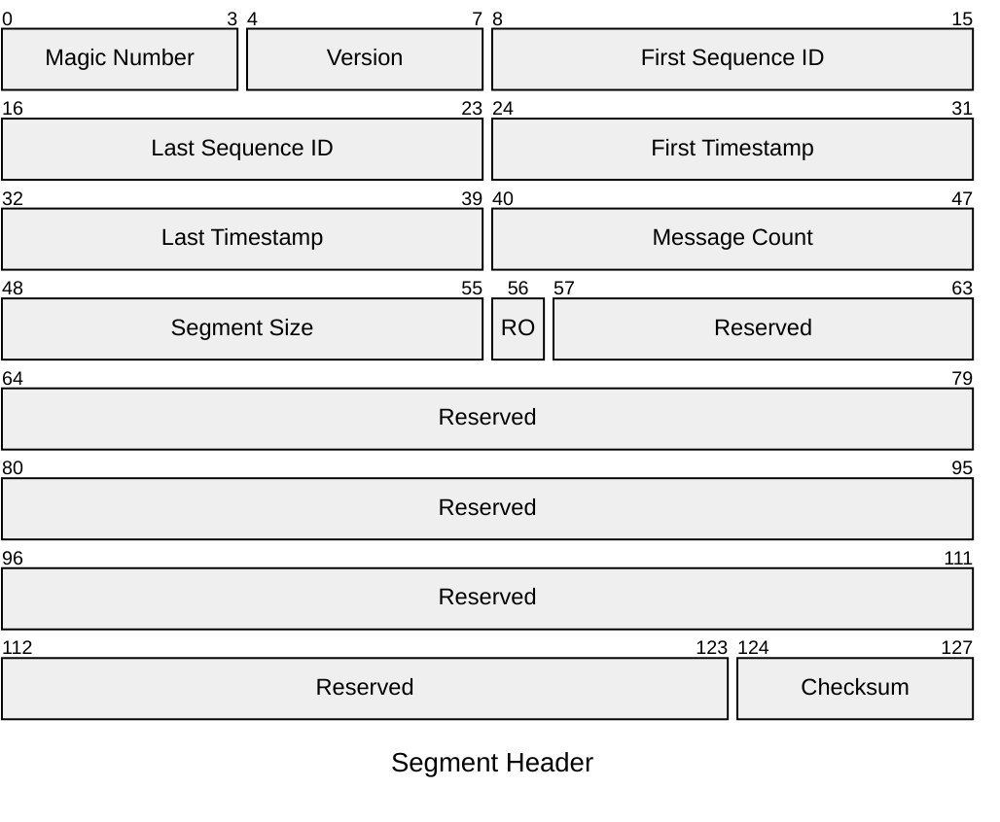
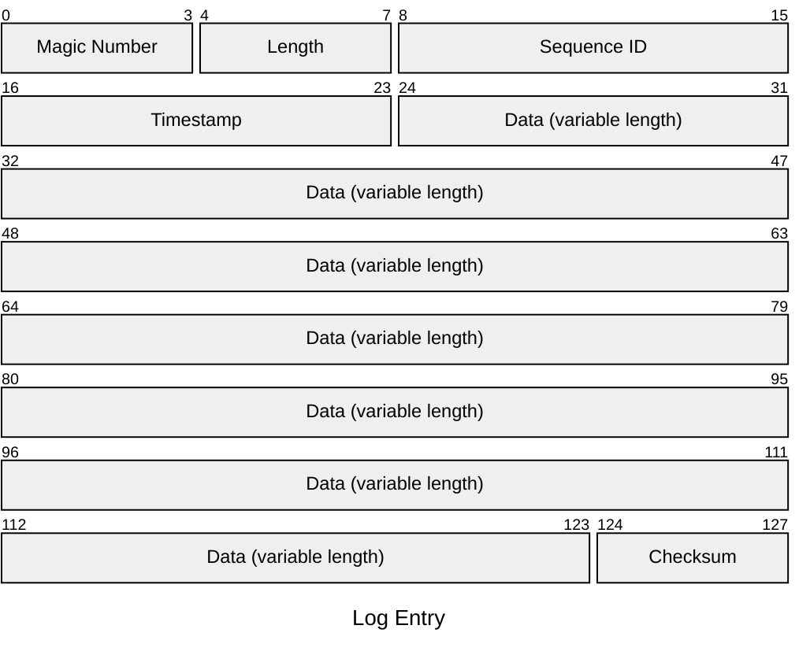

# Jaahas.WriteAheadLog

A .NET library for writing to a file-based write-ahead log (WAL).


# Getting Started

You can register a file-based `IWriteAheadLog` service with your application's dependency injection container as follows:

```csharp
services.AddWriteAheadLogServices().AddFile(options => {
    DataDirectory = "data/wal"
});
```

This registers a singleton `IWriteAheadLog` service with the specified data directory and default values for other settings. The `IWriteAheadLog` service can then be injected into your application components:

```csharp
var log = serviceProvider.GetRequiredService<IWriteAheadLog>();
```


# Registering Multiple Logs

You can register multiple named logs with different configurations as follows:

```csharp
services.AddWriteAheadLogServices()
    .AddFile("file-1", options => {
        DataDirectory = "data/wal-1"
    })
    .AddFile("file-2", options => {
        DataDirectory = "data/wal-2"
    });
```

You can then resolve a specific log in one of the following ways:

```csharp
// 1. Resolve a keyed IWriteAheadLog service by name:
var log1 = serviceProvider.GetRequiredKeyedService<IWriteAheadLog>("file-1");

// 2. Use the WriteAheadLogFactory service to retrieve a log by name:
var log2 = serviceProvider.GetRequiredService<WriteAheadLogFactory>()
    .GetWriteAheadLog("file-2");
```


# Writing Log Entries

To write log entries to the write-ahead log, use the `IWriteAheadLog.WriteAsync` method or one of its extension method overloads:

```csharp
await log.WriteAsync(Encoding.UTF8.GetBytes("Hello, World!"));
```

## Using the `LogWriter` Type

You can use the `LogWriter` class for scenarios where you require an `IBufferWriter<byte>` to write your log entries to. After writing your message to the `LogWriter`, you must call the `WriteToLogAsync` method to write the buffered data to the log as a new message:

```csharp
[MessagePackObject]
public class MyMessage {

    [Key(0)]
    public string Message { get; set; }

}

// ...

await using var writer = new LogWriter();
MessagePackSerializer.Serialize(writer, new MyMessage() {
    Message = "Hello, World!"
});

await writer.WriteToLogAsync(log);
```

The `LogWriter` type must be disposed after use to release rented resources. Each call to `WriteToLogAsync` resets the underlying buffer, meaning that you can also reuse the same `LogWriter` instance for multiple writes.


## Using the `JsonLogWriter` Type

The `JsonLogWriter` class can be used to automatically serialize structured log messages to JSON using `System.Text.Json` before writing them to the log:

```csharp
await using var jsonWriter = new JsonLogWriter();
await jsonWriter.WriteToLogAsync(log, new {)
    Message = "Hello, World!"
});
await jsonWriter.WriteToLogAsync(log, new {)
    Message = "Hello again!"
});
```

The `JsonLogWriter` class uses `LogWriter` internally and as such, it also requires disposal after use to release rented resources.


# Reading Log Entries

The `ReadAllAsync` method is used to read entries from the log. It returns an `IAsyncEnumerable<LogEntry>` that can be iterated over to process each log entry:

```csharp
await foreach (var entry in log.ReadAllAsync()) {
    // Process each log entry.
    Console.WriteLine($"Sequence ID: {entry.SequenceId}, Timestamp: {entry.Timestamp}, Data Length: {entry.Data.Length}");
    // Dispose of the entry after use.
    entry.Dispose();
}
```

> [!IMPORTANT]
> Dispose of the `LogEntry` instances after use to release shared resources!

By default, the `IAsyncEnumerable<LogEntry>` returned by `ReadAllAsync` will complete once it reaches the end of the log. If you want to read entries continuously as they are written, you can pass a `LogReadOptions` instance to the `ReadFromAsync` method that specifies to watch for changes. See below for more details.


## Specifying Read Options

You can optionally specify a `LogReadOptions` instance when calling the `ReadFromAsync` method. This allows you to perform operations such as specifying a starting sequence ID or timestamp, and limiting the number of entries to read:

```csharp
var readOptions = new LogReadOptions(SequenceId: 5678, Limit: 100);

await foreach (var entry in log.ReadAllAsync(readOptions)) {
    // Process each log entry.
    Console.WriteLine($"Sequence ID: {entry.SequenceId}, Timestamp: {entry.Timestamp}, Data Length: {entry.Data.Length}");
    // Dispose of the entry after use.
    entry.Dispose();
}
```


## Watching for Changes

You can also watch for changes in the log by passing a `LogReadOptions` instance with the `WatchForChanges` property set to `true`. This will keep the enumeration open and allow you to receive new log entries as they are written:

```csharp
var readOptions = new LogReadOptions(Timestamp: 638861024271000320, WatchForChanges: true);

await foreach (var entry in log.ReadAllAsync(readOptions)) {
    // Process each log entry.
    Console.WriteLine($"Sequence ID: {entry.SequenceId}, Timestamp: {entry.Timestamp}, Data Length: {entry.Data.Length}");
    // Dispose of the entry after use.
    entry.Dispose();
}
```

# File Structure

Log entries written to the file-based WAL are written sequentially to the log's current writable segment, and each segment is stored in a separate file. A segment file begins with a fixed-size header that contains metadata about the segment, followed by a series of log entries. Each log entry consists of a header, a variable-length payload, and a footer.

Segment files use the naming convention `{yyyyMMddHHmmss}-{UUIDv7}.wal`, where `{yyyyMMddHHmmss}` is the timestamp that the segment was created at (truncated to the nearest second) and `{UUIDv7}` is a UUIDv7 value that is generated using the segment creation time. This allows for easy identification and ordering of segments based on their creation time.


## Segment Header

The segment header is a fixed-length 128 byte structure that contains metadata about the segment:



## Log Entry

A log entry is a variable-length structure that contains the actual data written to the log. It consists of a fixed-length header, a variable-length payload and a fixed-length footer. For example, a log entry with a payload of 100 bytes would look like this:



# Configuring Rollover and Retention Policies

The `FileWriteAheadLogOptions` passed to the `FileWriteAheadLog` constructor define the rollover and retention policies for the write-ahead log. Segments can be rolled over based on any combination of size, time, or number of entries. Old segments can be retained for a specified period of time and/or removed once the number of closed segments exceeds a limit. You can also control how often clean-up is performed to remove old segments.

For example, the following configuration rolls over segments when they reach 1 MB in size, retains a maximum of 100 closed segments for 7 days, and performs clean-up every 12 hours:

```csharp
var options = new LogOptions() {
    DataDirectory = "data/wal",
    MaxSegmentSizeBytes = 1024 * 1024, // 1 MB
    SegmentRetentionLimit = 100,
    SegmentRetentionPeriod = TimeSpan.FromDays(7),
    SegmentCleanupInterval = TimeSpan.FromHours(12)
};
```


# Building the Solution

The repository uses [Cake](https://cakebuild.net/) for cross-platform build automation. The build script allows for metadata such as a build counter to be specified when called by a continuous integration system such as TeamCity.

A build can be run from the command line using the [build.ps1](./build.ps1) PowerShell script or the [build.sh](./build.sh) Bash script. For documentation about the available build script parameters, see [build.cake](./build.cake).


# Software Bill of Materials

To generate a Software Bill of Materials (SBOM) for the repository in [CycloneDX](https://cyclonedx.org/) XML format, run [build.ps1](./build.ps1) or [build.sh](./build.sh) with the `--target BillOfMaterials` parameter.

The resulting SBOM is written to the `artifacts/bom` folder.
