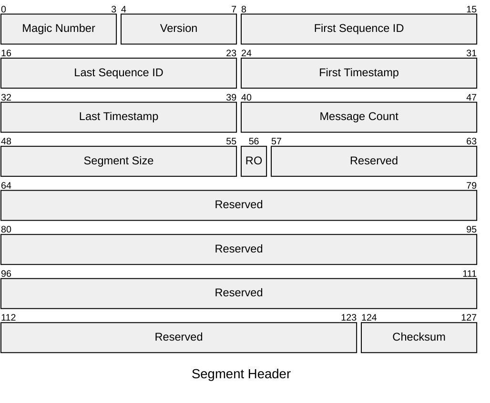
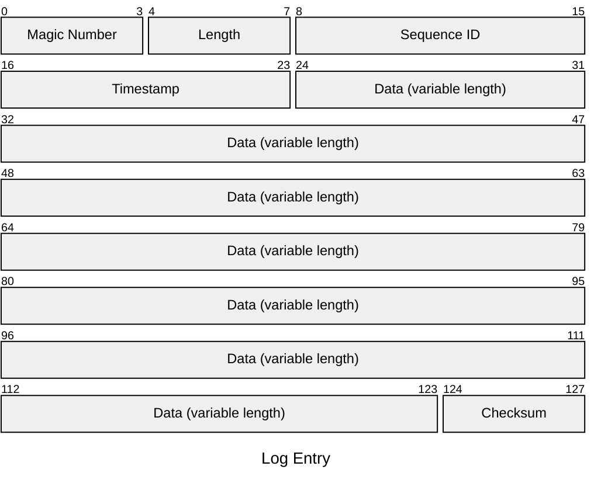

# Jaahas.WriteAheadLog

A .NET library for writing to a file-based write-ahead log (WAL).


# Getting Started

You can register the `Log` service with your application's dependency injection container as follows:

```csharp
services.AddWriteAheadLog(options => {
    DataDirectory = "data/wal"
});
```

This registers the singleton `Log` service with the specified data directory and default values for other settings. The `Log` service can then be injected into your application components.


# Writing Log Entries

To write log entries to the write-ahead log, use the `LogMessage` type to create a message and then call the `WriteAsync` method on the `Log` service. `LogMessage` implement `IBufferWriter<byte>` and so can easily be used with `Utf8JsonWriter` to serialize data to JSON before writing to the log:

```csharp
public async Task WriteEntryAsync<T>(T data, Log log) where T : notnull {
    using var msg = new LogMessage();
    await using var jsonWriter = new Utf8JsonWriter(msg);
    JsonSerializer.Serialize(jsonWriter, data);
    await log.WriteAsync(msg);
}
```
The `LogMessage` type must be disposed after use to release rented resources. You can also reuse the same `LogMessage` instance for multiple writes by calling the `Reset` method before each write. For example:

```csharp
public async Task WriteMultipleEntriesAsync<T>(IEnumerable<T> data, Log log) where T : notnull {
    using var msg = new LogMessage();
    await using var jsonWriter = new Utf8JsonWriter(msg);
    
    foreach (var item in data) {
        msg.Reset();
        JsonSerializer.Serialize(jsonWriter, item);
        await log.WriteAsync(msg);
    }
}
```

# Reading Log Entries


# File Structure

Each write-ahead log file contains a segment, which is a collection of log entries. The log entries are written sequentially to the segment, and each segment is stored in a separate file. The segment file begins with a fixed-size header that contains metadata about the segment, followed by a series of log entries. Each log entry consists of a header, a variable-length payload, and a footer.

Segment files use the naming convention `{yyyyMMddHHmmss}-{UUIDv7}.wal`, where `{yyyyMMddHHmmss}` is the timestamp that the segment was created at (truncated to the nearest second) and `{UUIDv7}` is a UUIDv7 value that is generated using the segment creation time. This allows for easy identification and ordering of segments based on their creation time.


## Segment Header

The segment header is a fixed-size 128 byte structure that contains metadata about the segment:



## Log Entry

A log entry is a variable-size structure that contains the actual data written to the log. It consists of a header, a variable-length payload and a footer. For example, a log entry with a payload of 100 bytes would look like this:




# Building the Solution

The repository uses [Cake](https://cakebuild.net/) for cross-platform build automation. The build script allows for metadata such as a build counter to be specified when called by a continuous integration system such as TeamCity.

A build can be run from the command line using the [build.ps1](./build.ps1) PowerShell script or the [build.sh](./build.sh) Bash script. For documentation about the available build script parameters, see [build.cake](./build.cake).


# Software Bill of Materials

To generate a Software Bill of Materials (SBOM) for the repository in [CycloneDX](https://cyclonedx.org/) XML format, run [build.ps1](./build.ps1) or [build.sh](./build.sh) with the `--target BillOfMaterials` parameter.

The resulting SBOM is written to the `artifacts/bom` folder.
