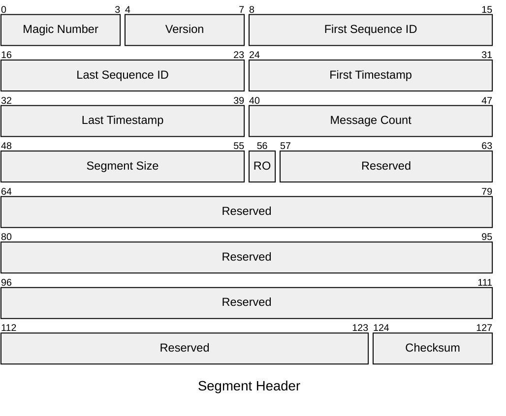
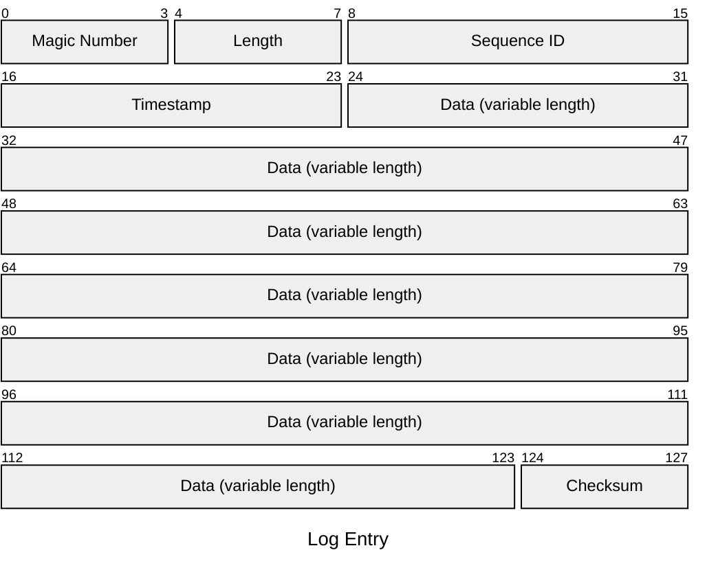

# Jaahas.WriteAheadLog

A .NET library for writing to a file-based write-ahead log (WAL).

# Getting Started

# Segments

## Segment Header

The segment header is a fixed-size 128 byte structure that contains metadata about the segment:

## Log Entry

A log entry is a variable-size structure that contains the actual data written to the log. It consists of a header, a variable-length payload and a footer. For example, a log entry with a payload of 100 bytes would look like this:

# Building the Solution

The repository uses [Cake](https://cakebuild.net/) for cross-platform build automation. The build script allows for metadata such as a build counter to be specified when called by a continuous integration system such as TeamCity.

A build can be run from the command line using the [build.ps1](./build.ps1) PowerShell script or the [build.sh](./build.sh) Bash script. For documentation about the available build script parameters, see [build.cake](./build.cake).

# Software Bill of Materials

To generate a Software Bill of Materials (SBOM) for the repository in [CycloneDX](https://cyclonedx.org/) XML format, run [build.ps1](./build.ps1) or [build.sh](./build.sh) with the `--target BillOfMaterials` parameter.

The resulting SBOM is written to the `artifacts/bom` folder.
